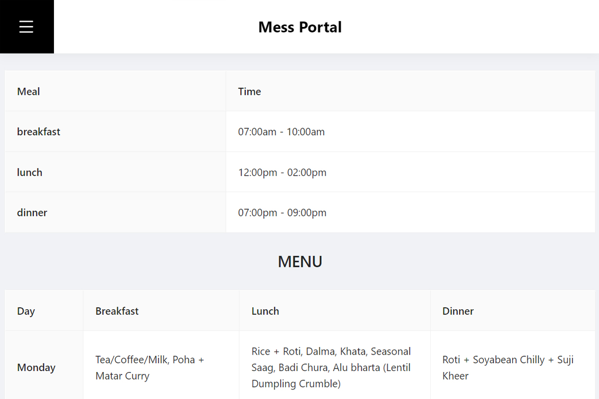
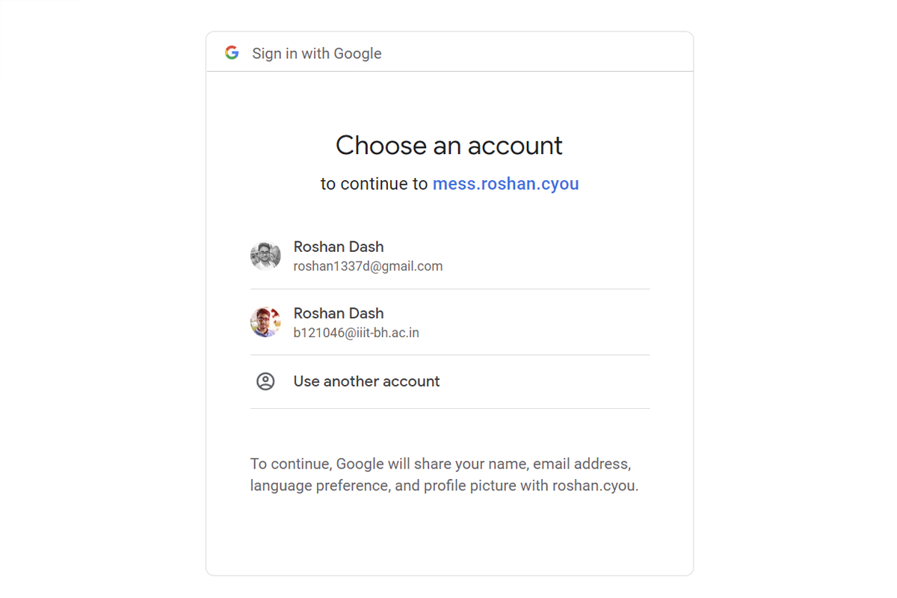
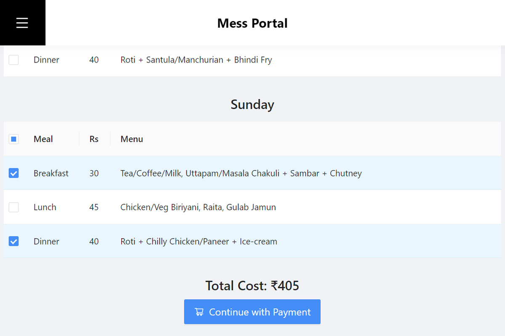
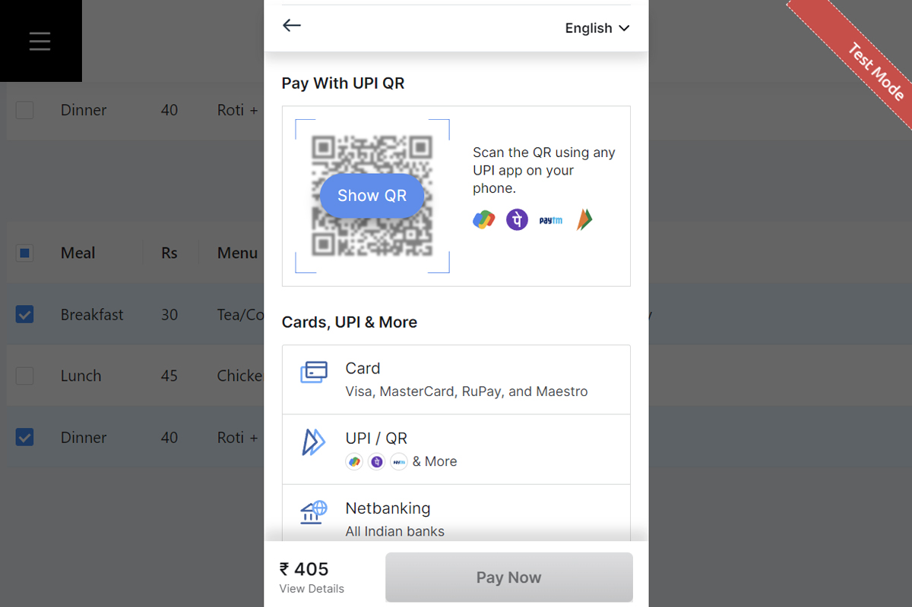
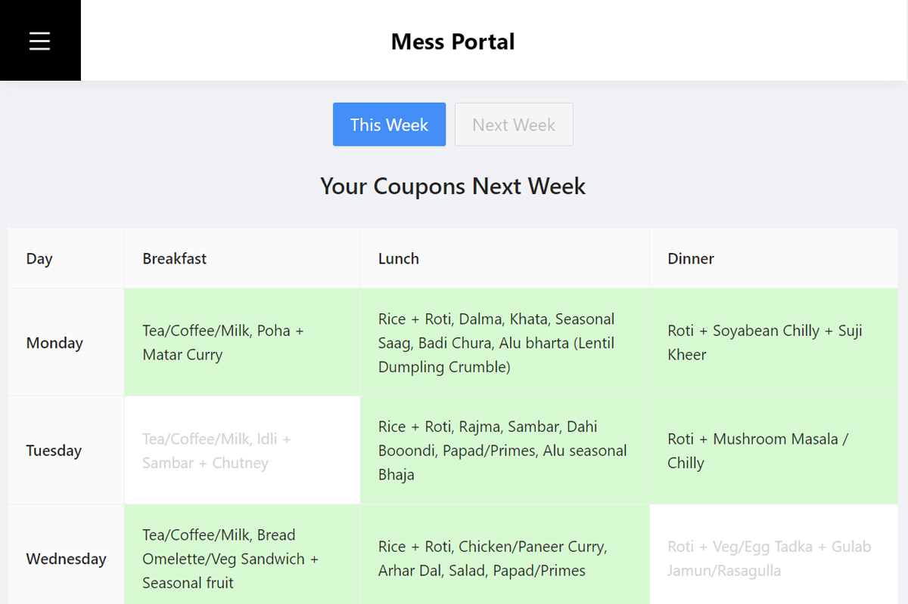
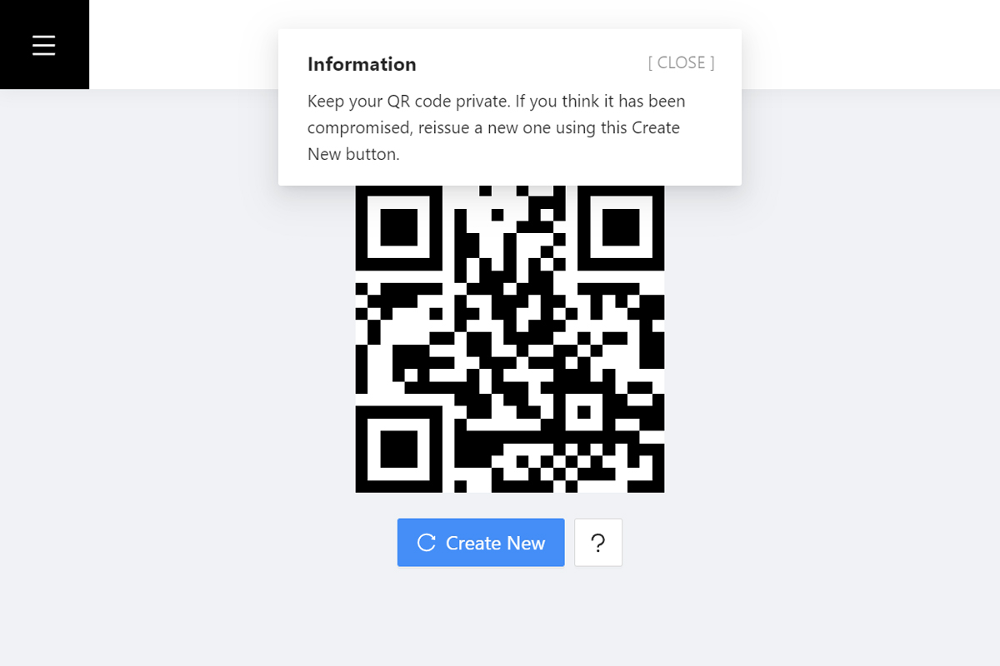
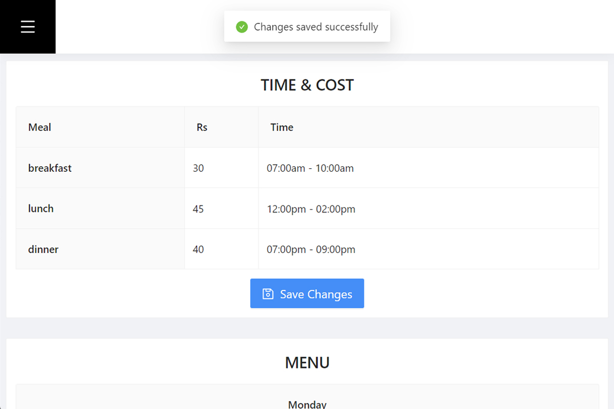
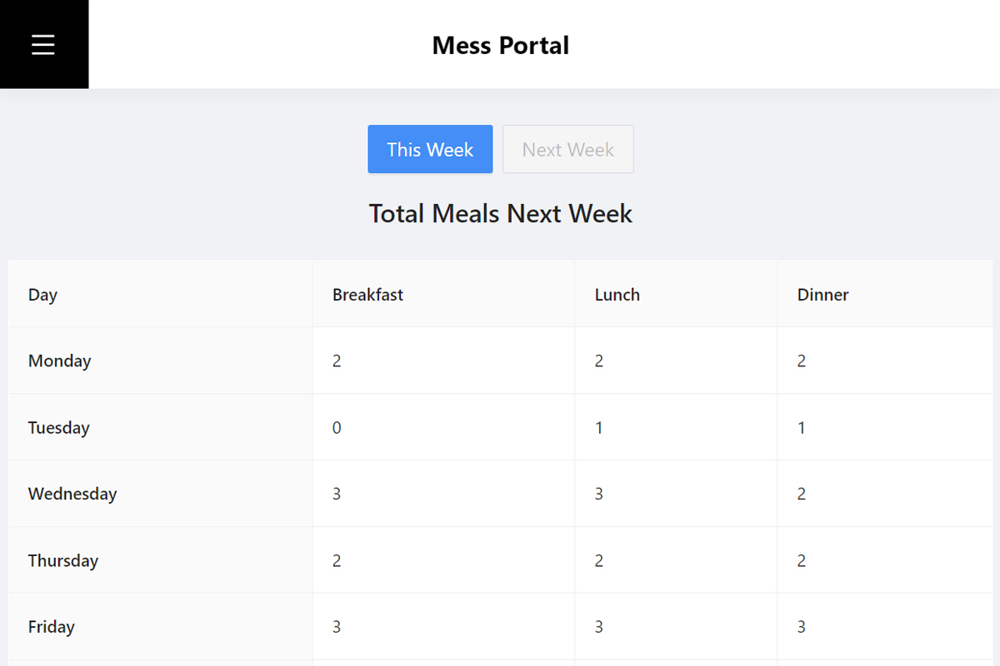
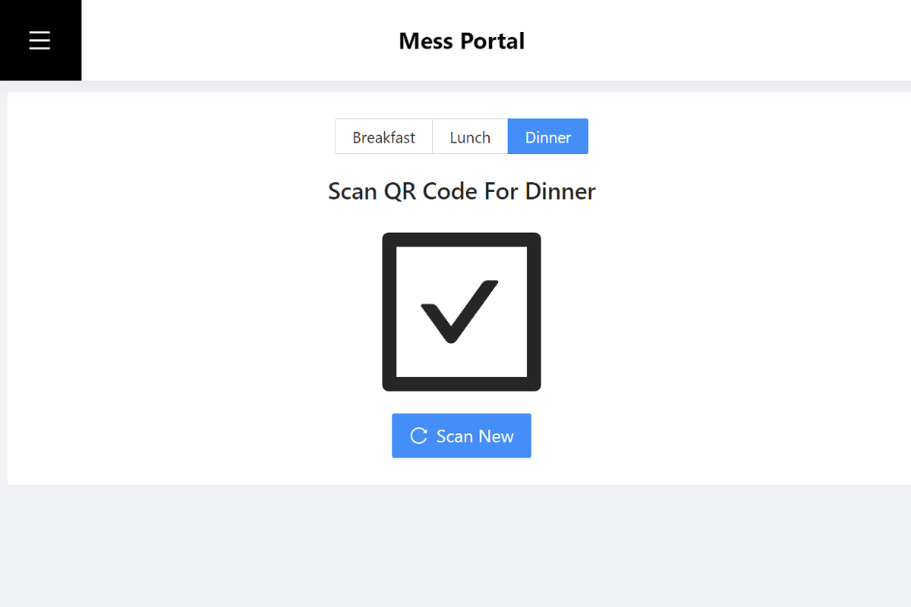

# Mess Portal

Mess Portal is a full-stack web application for managing a mess's weekly menu, meal timings and prices, student meal purchases, online payments, and QR-based coupon redemption. Students choose and pay for meals through the portal; administrators manage the service and scan a student's personal QR code instead of handling paper coupons.

> Built as an academic/demo project for the D3H05 mess-management problem statement. Review the security notes before deploying or using real personal or payment data.

## Contents

- [Features](#features)
- [How it works](#how-it-works)
- [Screenshots](#screenshots)
- [Technology](#technology)
- [Project structure](#project-structure)
- [Requirements](#requirements)
- [Local setup](#local-setup)
- [Configuration guide](#configuration-guide)
- [API overview](#api-overview)
- [Build and tests](#build-and-tests)
- [Troubleshooting](#troubleshooting)
- [Security and deployment notes](#security-and-deployment-notes)
- [Credits](#credits)

## Features

### Student portal

- Sign in and out using Google OAuth.
- View the weekly menu, serving times, and meal prices.
- Select individual meal options for the **current week** using checkboxes.
- See the order total update as meals are selected.
- Pay for selected meals through Razorpay Checkout.
- Review current-week and next-week coupon selections.
- Display one personal QR code for meal redemption and replace it if compromised.

### Administrator portal

- Add, rename, edit, and archive meal types separately for each day.
- Configure each meal's menu description, serving time, and price.
- View meal counts for this week and next week.
- Select the meal currently being served and scan a student's QR code to verify and redeem that coupon.
- Restrict administrator pages to the Google account configured in `ADMIN`.

## How it works

### Meal setup and purchase

1. The administrator configures meal options for each day, including their names, dishes, serving times, and prices.
2. A student signs in, opens **Buy coupons**, and checks the meals they want for the current week.
3. The total is calculated in the page for convenience. When creating a Razorpay order, the server independently checks the selected meals and calculates the amount from the configured menu prices.
4. **Continue with Payment** opens Razorpay Checkout. The server verifies Razorpay's payment signature before activating the selected coupons in the student's account.
5. The student can review meal selections in **Purchase history**.

### QR coupon redemption

- Each student has one personal QR code. The code identifies the student; it is not a separate QR code for each meal.
- At serving time, an administrator opens **Scan QR code**, selects the meal type being served, and scans the student's code.
- The server checks that the student has an unredeemed coupon for that meal on the current day and in the current week.
- A successful scan redeems the coupon. The same coupon cannot be redeemed again.
- Meal/day selection and week boundaries use **Asia/Kolkata** time.

## Screenshots



















## Technology

| Area | Technologies |
| --- | --- |
| Frontend | React 18, React Router 6, Ant Design, Axios |
| UI and motion | CSS Modules, Framer Motion |
| QR code | `qrcode.react`, `react-qr-reader` |
| Backend | Node.js, Express 4 |
| Database | MongoDB Atlas or another MongoDB deployment, Mongoose 6 |
| Authentication and sessions | Google OAuth 2.0, Passport, Express Session, `connect-mongo` |
| Payments | Razorpay |

## Project structure

```text
.
├── assets/                 # README screenshots
├── config/
│   └── passport.js         # Google OAuth strategy
├── frontend/
│   ├── public/             # React public files
│   └── src/
│       ├── components/     # Shared navigation and weekly-menu components
│       ├── routes/         # Student and administrator pages
│       └── utility/        # Route transitions and UI helpers
├── models/                 # Mongoose user, menu, buyer, time, and order models
├── routes/                 # Express authentication and API routes
├── index.js                # Express server and middleware
├── package.json            # Backend scripts and dependencies
└── SETUP.md                # Short setup pointer
```

## Requirements

- Node.js and npm.
- A reachable MongoDB database and connection string.
- A Google Cloud OAuth 2.0 client.
- Razorpay API keys. Use test keys during development.
- Camera permission and a secure browser context (HTTPS, or `localhost`) for QR scanning.

## Local setup

### 1. Clone the repository

Replace the placeholder with your GitHub repository URL:

```sh
git clone <your-repository-url>
cd <repository-directory>
```

### 2. Create the local environment file

Create `config/config.env` next to `config/passport.js`. Use your own credentials; do not paste real credentials into this README or commit the environment file.

```dotenv
PORT=4000
FRONTEND=http://localhost:4000
MONGO_URI=mongodb+srv://<db-user>:<url-encoded-password>@<cluster-host>/<database>?retryWrites=true&w=majority
GOOGLE_CLIENT_ID=<your-google-oauth-client-id>
GOOGLE_CLIENT_SECRET=<your-google-oauth-client-secret>
CALLBACK_URL=http://localhost:4000/api/auth/google/callback
PAY_ID=<your-razorpay-key-id>
PAY_SECRET=<your-razorpay-key-secret>
ADMIN=<administrator-google-account-email>
```

`config.env` is ignored by Git. The application loads this file from `config/config.env` when started from the repository root.

### 3. Configure MongoDB

For MongoDB Atlas:

1. Create a database user and note its username and password.
2. In **Security → Network Access**, allow your current public IP address.
3. Copy the Atlas connection string and replace its placeholders with your cluster, database, and database-user details.
4. URL-encode special characters in the database user's password before placing it in the URI.

Do not use `0.0.0.0/0` as a permanent network-access rule. If the server cannot connect, see [Troubleshooting](#troubleshooting).

### 4. Configure Google OAuth

1. Create an OAuth 2.0 **Web application** client in Google Cloud Console.
2. Add `http://localhost:4000` to **Authorized JavaScript origins**.
3. Add `http://localhost:4000/api/auth/google/callback` to **Authorized redirect URIs**.
4. Put the client ID and secret in `GOOGLE_CLIENT_ID` and `GOOGLE_CLIENT_SECRET`.
5. Set `ADMIN` to the Google account email that should access administrator features.

### 5. Configure Razorpay

Create or use a Razorpay account, then add the key ID and key secret to `PAY_ID` and `PAY_SECRET`. Use test-mode credentials locally. A successful payment is not enough by itself: the server verifies the payment signature before activating coupons.

### 6. Install and start

From the repository root:

```sh
npm install
npm start
```

The root `postinstall` script installs frontend dependencies. `npm start` builds the React app and then starts the Express server. Open [http://localhost:4000](http://localhost:4000).

## Configuration guide

| Variable | Purpose |
| --- | --- |
| `PORT` | Port for the Express server (for example, `4000`). |
| `FRONTEND` | URL used after Google sign-in or sign-out (for local use, `http://localhost:4000`). |
| `MONGO_URI` | MongoDB connection string used by Mongoose and the session store. |
| `GOOGLE_CLIENT_ID` | Google OAuth client ID. |
| `GOOGLE_CLIENT_SECRET` | Google OAuth client secret. |
| `CALLBACK_URL` | OAuth callback URL; must match the Google Cloud authorized redirect URI. |
| `PAY_ID` | Razorpay key ID. |
| `PAY_SECRET` | Razorpay key secret, used on the server for order creation and payment verification. |
| `ADMIN` | Google account email allowed to access administrator routes. |

## API overview

All APIs are served by the Express application. `/api/user/*` requires a signed-in user; `/api/admin/*` requires the configured administrator account.

| Method | Endpoint | Access | Purpose |
| --- | --- | --- | --- |
| `GET` | `/api/auth/signin` | Public | Start Google OAuth sign-in. |
| `GET` | `/api/auth/google/callback` | OAuth callback | Complete Google sign-in. |
| `GET` | `/api/auth/signout` | Signed-in session | Sign out and redirect to `FRONTEND`. |
| `GET` | `/api/data/menu` | Public | Read the weekly menu and meal options. |
| `GET` | `/api/data/time` | Public | Read serving times and prices. |
| `GET` | `/api/data/status` | Public | Read signed-in and administrator status. |
| `POST` | `/api/admin/setMenu` | Administrator | Save day-wise meal types, menu items, times, and prices. |
| `POST` | `/api/admin/setTime` | Administrator | Legacy timing/pricing endpoint. |
| `POST` | `/api/admin/meals` | Administrator | Get meal counts for `this` or `next` week. |
| `GET` | `/api/user/data` | Signed-in user | Read the user's QR secret and coupon selections. |
| `GET` | `/api/user/resetSecret` | Signed-in user | Replace the QR secret. |
| `GET` | `/api/user/boughtThisWeek` | Signed-in user | Check whether this week's coupons have been purchased. |
| `POST` | `/api/user/createOrder` | Signed-in user | Validate selections, calculate the server-side total, and create a Razorpay order. |
| `POST` | `/api/user/checkOrder` | Signed-in user | Verify payment signature and activate coupons. |
| `POST` | `/api/user/checkCoupon` | Administrator | Verify and redeem a coupon for today's meal. |

## Build and tests

Build the frontend directly:

```sh
npm --prefix frontend run build
```

Start the application (also builds the frontend):

```sh
npm start
```

Run the frontend test runner:

```sh
npm --prefix frontend test
```

The test script uses Create React App's interactive test runner. Press `a` to run all tests, or set `CI=true` to run in CI mode.

## Troubleshooting

### MongoDB Atlas cannot connect

Check that:

- Your current IP address is in the Atlas **Network Access** list.
- The cluster is running and the database user is active.
- `MONGO_URI` has the correct cluster host, database user, password, and database name.
- Special characters in the database password are URL-encoded.
- A VPN, firewall, or restricted network is not blocking Atlas access.

### Google sign-in returns a redirect URI error

The callback URL in Google Cloud must exactly match `CALLBACK_URL`, including protocol, host, port, and `/api/auth/google/callback`.

### QR scanner cannot open the camera

Grant camera permission in the browser. Camera access generally requires HTTPS; `localhost` is allowed for local development. On mobile, open the deployed site using HTTPS.

### Razorpay order or payment verification fails

Confirm that `PAY_ID` and `PAY_SECRET` are a matching key pair from the same Razorpay mode (test or live). Check that the server can reach Razorpay and that the user completed checkout. Coupons are activated only after successful server-side signature verification.

## Security and deployment notes

- Never commit `config/config.env` or disclose database, Google OAuth, or Razorpay credentials. If a secret has been published, revoke or rotate it.
- This repository is an academic/demo application, not a hardened production service.
- The current Express session secret is hardcoded in `index.js`. Configure a strong secret through environment configuration before production use.
- Review session cookie settings, HTTPS/TLS, CSRF protections, request validation, rate limiting, error handling, and logging before exposing the service publicly.
- Restrict MongoDB network access to trusted addresses and use least-privilege database credentials.
- Use Razorpay live keys only after the payment and coupon-redemption flows have been tested end to end.
- The backend trusts the configured `ADMIN` email for administrator access; protect that Google account with strong authentication.

## Credits

- Ajay Prajapati — Developer

